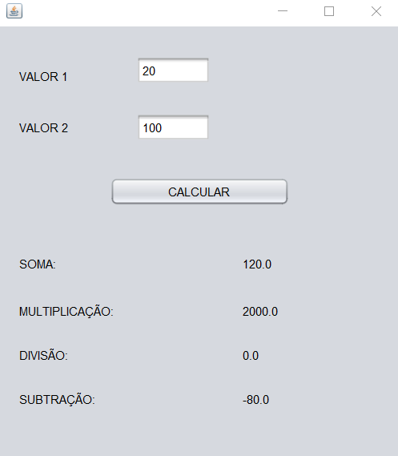

# ARITMETICA SWING
👨‍🏫4 OPERAÇÕES ARITMETICAS DE DOIS VALORES COM JAVA-SWING.

  

## DESCRIÇÃO:
- O aplicativo "Aritmetica Swing" é uma aplicação gráfica desenvolvida em Java utilizando a biblioteca Swing. Seu objetivo é realizar operações aritméticas básicas entre dois números fornecidos pelo usuário.

- A interface gráfica do aplicativo é construída utilizando componentes Swing, incluindo labels, text fields e um botão. A disposição dos componentes é gerenciada através de um layout para garantir que todos os elementos estejam organizados de maneira lógica e acessível.

- Esse é uma ferramenta simples e eficaz para calcular e exibir resultados de operações aritméticas básicas entre dois números. Ele serve como um exemplo prático de uso da biblioteca Swing para construir interfaces gráficas interativas em Java.

## FUNCIONALIDADES:
1. **Entrada de Dados:**
   - O usuário pode inserir dois valores numéricos (`VALOR 1` e `VALOR 2`) em campos de texto (`txtN1` e `txtN2`).

2. **Botão de Cálculo:**
   - O aplicativo possui um botão denominado "CALCULAR" (`btnCalcular`). Quando clicado, ele realiza os cálculos aritméticos com os valores fornecidos.

3. **Operações Aritméticas:**
   - **Soma:** Adiciona os dois valores.
   - **Multiplicação:** Multiplica os dois valores.
   - **Divisão:** Divide o primeiro valor pelo segundo (considerando que o segundo valor não seja zero).
   - **Subtração:** Subtrai o segundo valor do primeiro.

4. **Exibição dos Resultados:**
   - Os resultados das operações são exibidos em labels correspondentes:
     - `lbnSoma` exibe o resultado da soma.
     - `lbnMultiplicacao` exibe o resultado da multiplicação.
     - `lbnDivisao` exibe o resultado da divisão.
     - `lbnSubitracao` exibe o resultado da subtração.

## ABRINDO O PROJETO NO NETBEANS IDE:
   1. **Inicie o NetBeans:**
      Abra o NetBeans IDE a partir do menu Iniciar (Windows) ou do lançador de aplicativos (macOS).

   2. **Navegue até o Projeto:**
      No menu superior, clique em "Arquivo" (ou "File" em inglês) e escolha "Abrir Projeto" (ou "Open Project").

   3. **Selecione o Diretório do Projeto:**
      Navegue até o diretório `CODIGO`, onde está localizado o projeto e selecione a pasta principal. Esta pasta contém o arquivo `pom.xml`.

   4. **Abra o Projeto:**
      Selecione a pasta do projeto e clique em "Abrir" (ou "Open" em inglês).

   5. **Aguarde a Abertura:**
      O NetBeans irá carregar o projeto. Isso pode levar alguns momentos, dependendo do tamanho do projeto e da velocidade do seu computador.

   6. **Projeto Aberto:**
      Uma vez que o projeto é carregado com sucesso, ele aparecerá no painel "Projetos" no canto esquerdo do IDE, e você poderá executa-lo clicando em `Run`.

## TECNOLOGIAS USADAS:
- [LINGUAGEM JAVA:](https://github.com/VILHALVA/CURSO-DE-JAVA) A linguagem de programação Java é amplamente utilizada para o desenvolvimento de aplicativos devido à sua portabilidade, segurança e robustez. Ela é uma escolha popular para desenvolver aplicativos desktop, web e móveis.

- [JAVA SWING:](https://github.com/VILHALVA/CURSO-DE-JAVA-SWING) Java Swing é um conjunto de bibliotecas gráficas para a criação de interfaces de usuário (UI) em Java. Ele fornece componentes gráficos avançados, como botões, caixas de texto, tabelas e muito mais, permitindo que os desenvolvedores criem aplicativos desktop com uma interface de usuário rica e interativa.

- [NETBEANS IDE](https://netbeans.apache.org/download/index.html) O NetBeans IDE é um ambiente de desenvolvimento integrado gratuito e de código aberto para o desenvolvimento de aplicativos Java, bem como para várias outras linguagens de programação, como PHP, C/C++, e HTML5. Ele oferece uma série de recursos poderosos, como edição de código avançada, depuração, controle de versão e integração com servidores de aplicativos, facilitando o desenvolvimento de software em Java e outras plataformas.

## CREDITOS:
- [PROJETO CRIADO PELO VILHALVA](https://github.com/VILHALVA)

